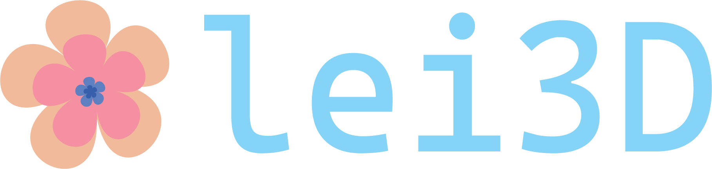

# lei3D

## About
This is a dual repo to support the custom game engine Lei3D and the game that implements it, [SkyLei](https://docs.google.com/document/d/1Ktms7R8Q_NFXl61THuaZg5ugdS3S1yB7YlfEAdG3e6E/edit).  

## Features
* Build System for Windows, Mac, Linux - CMake
* Rendering of meshes and scenes - Assimp
  * Support imports from Blender in .obj format
* Physics, Quake-like air strafing and bunny hopping. Rigid Body Collisions - Bullet3
* GUI and dev tools - imgui
  * Level Editor
  * User Interface
  * Frames Per Second (FPS) counter
  * Frame Limiter
  * Level Switching
  * Scene Edit/Play mode & Pausing/Resetting Levels
* Player Controller / Input System
* Entity Component System (ECS)
  * Includes naming for entities
* Forward Rendering 
  * Point Lights
  * Multi-Render Passes
  * Shadows and Post Processing 
  * Skybox Rendering

## Build

lei3d has originally been created using Visual Studio 2022 on Windows. It has been tested on other platforms, to compile, please follow the instructions below to use CMake to create a build for whatever system you are currently running on. 

### Windows
1) Download [CMake](https://cmake.org/download/). Ensure to set Cmake available on path to all users.
2) Open CMake GUI tool. Select source code to be the root directory of this cloned repo
3) Create a new folder called 'build'. Set this to be where we build our binaries
4) Press generate
5) Open the generated sln file with Visual Studio 2022
6) Under the solution explorer, find lei3d. Right click and press build
7) Right click lei3d again, set it as the startup project. 
8) Run the project.

### Mac
1) Navigate to the project folder
2) Make a build folder `mkdir build`  
3) Enter the folder `cd build`
4) Compile your project `cmake ..`
5) Call `make`
6) cd `/src/engine`
7) `./lei3d`

### Linux
1) Navigate to the project folder
2) Make a build folder `mkdir build`  
3) Enter the folder `cd build`
4) Compile your project `cmake ..`
5) Call `make`
6) cd `/src/engine`
7) `./lei3d`

## requirements
Graphics card that support OpenGL 4.6

* GLFW library - https://www.glfw.org
* GLAD library - https://glad.dav1d.de/
* GLM library - https://glm.g-truc.net
* stb image library - https://github.com/nothings/stb/blob/master/stb_image.h

# SkyLei - Surf The Sky Islands

## Overview
[SkyLei](https://docs.google.com/document/d/1Ktms7R8Q_NFXl61THuaZg5ugdS3S1yB7YlfEAdG3e6E/edit) is a game that presents a unique twist in the world of speed running games by focusing on slowing down.

In a world that is shattered to pieces and taken to islands in the sky, SkyLei follows the exhilarating plight of Leilani Leaf through a colorless, once beautiful world. Primary gameplay consists of racing around and exploring a surreal-dreamlike world with physics-based movement. The levels of the world add new features that inspire new routes and discovery of the world. This adds challenge and enjoyment to players of any skill-level. At the very end of each level, Leilani brings color back to the world when she discovers the beauty of all that surrounds her. 

## Controls:
WASD - movement 
look around the scene by moving mouse
tab to unlock cursor to interact with the gui

## Showcase

https://github.com/kevinsadi/lei3d/assets/34428034/03b79d4f-4c9a-4242-a1af-bd24f0827ae5

https://github.com/kevinsadi/lei3d/assets/34428034/15107ca3-2cdf-4669-b7b0-aa62eae0ce57
